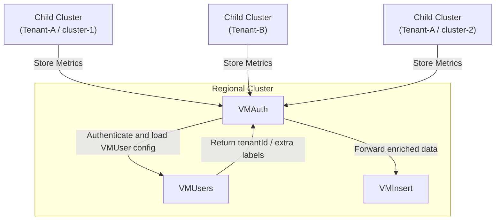

# Multi-tenancy

## Overview

KOF supports multi-tenancy to isolate monitoring, logging, and tracing data between different tenants. The implementation is based on automatic configuration of data labeling and filtering in VictoriaMetrics, VictoriaLogs, and VictoriaTraces using tenant IDs.

## Architecture

Multi-tenancy is enforced by **VMAuth** based on **VMUser** resources.
A separate VMUser is created for each cluster.

When a tenant ID is specified, the corresponding VMUser is configured with:

- **ExtraLabels**: automatically adds `tenantId=<TENANT_ID>` to all ingested metrics, logs and traces.
- **ExtraFilters**: restricts read access to data matching the specified `tenantId`.



On the regional cluster, VMUser resources are also created with administrative access. These users are not restricted by ExtraFilters, allowing them to read metrics, logs, and traces across all tenants.

## How to Enable Multi-tenancy

The primary label used for tenant identification is:

```yaml
k0rdent.mirantis.com/kof-tenant-id: <TENANT_ID>
```

This label must be specified on child `ClusterDeployment` resources to define the tenant ID.

All dependent resources (such as secrets and VMUser objects) are created automatically by the operator. For more details, see the [storage credentials](./storage-creds.md) documentation.
