# k0rdent.mirantis.com — Resource Relationships

This document describes the relationships between custom resource kinds in the
`k0rdent.mirantis.com`, `kof.k0rdent.mirantis.com`, `config.projectsveltos.io`, and
`lib.projectsveltos.io` API groups, discovered from a live cluster using
`metadata.ownerReferences` and `spec`-level field references.

## Relationship types

| Arrow style | Meaning |
|---|---|
| `-.->` dashed | `ownerReference` — child is garbage-collected when owner is deleted |
| `-->` solid | `spec` field reference by name |
| Labels on arrows | the field or relationship type |

---

## Diagram

```mermaid
graph TD

  %% ── k0rdent: cluster-scoped core ────────────────────────────────

  subgraph k0rdent_cluster["k0rdent.mirantis.com — cluster-scoped"]
    Management["Management"]
    Release["Release"]
    AccessManagement["AccessManagement"]
    StateManagementProvider["StateManagementProvider"]
    ProviderTemplate["ProviderTemplate"]
    ProviderInterface["ProviderInterface"]
    MultiClusterService["MultiClusterService"]
  end

  Management -->|"spec.release"| Release
  Management -.->|"owns"| AccessManagement
  Management -.->|"owns"| StateManagementProvider
  Release -.->|"owns"| ProviderTemplate

  %% ── k0rdent: namespaced ──────────────────────────────────────────

  subgraph k0rdent_ns["k0rdent.mirantis.com — namespaced"]
    ClusterDeployment["ClusterDeployment"]
    Credential["Credential"]
    ServiceSet["ServiceSet"]
    ClusterTemplate["ClusterTemplate"]
    ClusterTemplateChain["ClusterTemplateChain"]
    ServiceTemplate["ServiceTemplate"]
    ServiceTemplateChain["ServiceTemplateChain"]
  end

  ClusterTemplateChain -->|"spec.supportedTemplates[]"| ClusterTemplate
  ServiceTemplateChain -->|"spec.supportedTemplates[]"| ServiceTemplate

  ClusterDeployment -->|"spec.template"| ClusterTemplate
  ClusterDeployment -->|"spec.credential"| Credential
  ClusterDeployment -.->|"owns"| ServiceSet

  Credential -->|"spec.identityRef"| Secret

  ServiceSet -->|"spec.multiClusterService"| MultiClusterService
  ServiceSet -->|"spec.provider"| StateManagementProvider

  MultiClusterService -->|"spec.services[].template\n(label-selector driven)"| ServiceTemplate

  %% ── core/v1 ──────────────────────────────────────────────────────

  Secret["Secret\n(core/v1)"]
  ConfigMap["ConfigMap\n(core/v1)"]

  %% ── kof.k0rdent.mirantis.com ─────────────────────────────────────

  subgraph kof["kof.k0rdent.mirantis.com — namespaced"]
    PromxyServerGroup["PromxyServerGroup"]
  end

  %% kof-operator path: regional ClusterDeployment → ConfigMap → PromxyServerGroup
  ClusterDeployment -.->|"owns\n(regional clusters)"| ConfigMap
  ConfigMap -.->|"owns"| PromxyServerGroup

  %% Helm path: kof-storage HelmRelease creates standalone PromxyServerGroups (mothership)
  HelmRelease -.->|"owns\n(mothership)"| PromxyServerGroup

  %% PromxyServerGroup is consumed by promxy/vlogxy via label selector
  PromxyServerGroup -->|"label: secret-name\n(consumed by)"| AggregatorSecret["Secret: promxy/vlogxy config\n(core/v1)"]

  %% ── flux/helm ────────────────────────────────────────────────────

  HelmRelease["HelmRelease\n(helm.toolkit.fluxcd.io)"]

  %% ── lib.projectsveltos.io ────────────────────────────────────────

  subgraph sveltos_lib["lib.projectsveltos.io — cluster/namespaced"]
    SveltosCluster["SveltosCluster\n(namespaced)"]
    Classifier["Classifier\n(cluster-scoped)"]
    DebuggingConfiguration["DebuggingConfiguration\n(cluster-scoped)"]
  end

  SveltosCluster -->|"spec.kubeconfigSecret"| Secret

  %% ── config.projectsveltos.io ─────────────────────────────────────

  subgraph sveltos_config["config.projectsveltos.io — namespaced"]
    Profile["Profile"]
    ClusterSummary["ClusterSummary"]
    ClusterConfiguration["ClusterConfiguration"]
    ClusterProfile["ClusterProfile\n(cluster-scoped)"]
  end

  %% ── Cross-group: k0rdent → projectsveltos ────────────────────────

  ServiceSet -.->|"owns"| Profile

  Profile -->|"spec.clusterRefs[]"| SveltosCluster
  Profile -.->|"owns"| ClusterSummary
  Profile -.->|"owns"| ClusterConfiguration
```

---

## Key relationships explained

### Management → Release → ProviderTemplate

`Management` is the cluster root object. It references a `Release` via `spec.release`.
The `Release` defines which Helm chart versions to use for every provider and **owns** all
`ProviderTemplate` instances — when the Release is deleted, all ProviderTemplates are
garbage-collected.

### ClusterDeployment — the primary user object

`ClusterDeployment` is the main user-facing resource. It wires together:

- **`spec.template`** → `ClusterTemplate` — what cluster topology/provider to use
- **`spec.credential`** → `Credential` → `Secret` — kubeconfig or cloud credentials
- **`ownerReferences`** → `ServiceSet` children — which services to install on the cluster

### MultiClusterService — standing policy via label selectors

`MultiClusterService` is a cluster-scoped policy object. It selects `ClusterDeployments` by
label and declares which `ServiceTemplates` to apply. When a `ClusterDeployment` matching the
selector is created, the KCM controller automatically creates a `ServiceSet` child linking
the two — so services are applied without any per-cluster configuration.

### ServiceSet → Profile (cross-group boundary)

`ServiceSet` is an **owned** child of `ClusterDeployment`. When `spec.provider` names a
`StateManagementProvider` backed by Sveltos, the KSM controller translates each `ServiceSet`
into a `config.projectsveltos.io/v1beta1 Profile`, also owned by the `ServiceSet`. This is
the key bridge between the k0rdent and Sveltos APIs.

### Profile — Sveltos execution unit

`Profile` is the Sveltos resource that performs the actual Helm/kustomize rendering onto a
target cluster. It targets clusters via:

- **`spec.clusterRefs[]`** → `SveltosCluster` — direct cluster reference
- **`spec.templateResourceRefs[]`** → management-cluster resources used during template
  instantiation — not a cluster-targeting reference; cluster selection belongs under
  `spec.clusterRefs[]` / `spec.clusterSelector`

It **owns** two status/audit resources:

- `ClusterSummary` — per-cluster summary of deployed resources
- `ClusterConfiguration` — per-cluster record of applied configuration

### SveltosCluster — cluster representation in Sveltos

`SveltosCluster` (`lib.projectsveltos.io`) is the Sveltos-side representation of a registered
cluster. It holds a reference to the kubeconfig `Secret` used to reach that cluster. Both
`Profile` and `MultiClusterService` resolve their target clusters through `SveltosCluster`.

### Template chains

`ClusterTemplateChain` and `ServiceTemplateChain` declare which template versions are supported
and available for upgrade, grouping related `ClusterTemplate` / `ServiceTemplate` versions
under a single chain object.

### PromxyServerGroup — metrics and logs aggregation routing (kof.k0rdent.mirantis.com)

`PromxyServerGroup` is the only CRD in the `kof.k0rdent.mirantis.com` group. It describes a
remote storage backend (target URL, auth, TLS, path prefix) for the `promxy` metrics aggregator
or `vlogxy` logs aggregator running on the mothership. Instances are created via two paths:

- **kof-operator** (for regional clusters): watches `ClusterDeployment` resources labelled
  `kof-cluster-role=regional`, creates an intermediate `ConfigMap` (owned by the
  `ClusterDeployment`) and then creates `PromxyServerGroup` instances owned by that ConfigMap —
  one for metrics, one for logs.
- **Helm** (for the mothership): the `kof-storage` HelmRelease creates standalone
  `PromxyServerGroup` instances pointing at the local mothership VictoriaMetrics/VictoriaLogs.

The `promxy` and `vlogxy` deployments discover relevant groups via label selector
(`k0rdent.mirantis.com/secret-name`) and dynamically rebuild their aggregator config `Secret`.
