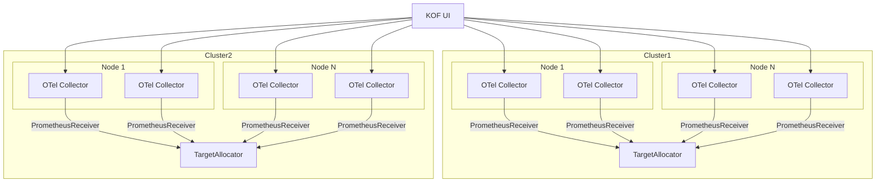

# UI

## Overview

The UI is available on the kof-operator 9090 port by default.

When the [TargetAllocator](https://opentelemetry.io/docs/platforms/kubernetes/operator/target-allocator/) is in use, the configuration of [OpentelemetryCollectors](https://opentelemetry.io/docs/collector/) Prometheus [receivers](https://github.com/open-telemetry/opentelemetry-collector-contrib/tree/main/receiver/prometheusreceiver#prometheus-api-server) is distributed across the cluster.

To collect the metrics metadata similar as prometheus server can show, we use kof-operator.



Access to UI:

```bash
kubectl port-forward pod/kof-mothership-kof-operator-789877f97d-pgqs8 9090:9090 -n kof
```

Screenshot:


